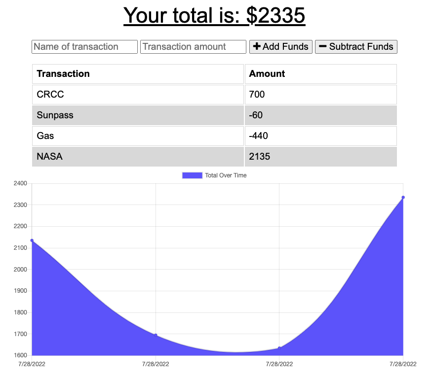

# Budget Tracker Starter Code

## User Story
- AS AN avid traveler
- I WANT to be able to track my withdrawals and deposits with or without a data/internet connection
- SO THAT my account balance is accurate when I am traveling 

## Acceptance Criteria

- GIVEN a budget tracker without an internet connection
- WHEN the user inputs an expense or deposit
    - THEN they will receive a notification that they have added an expense or deposit
- WHEN the user reestablishes an internet connection
    - THEN the deposits or expenses added while they were offline are added to their transaction history and their totals are updated

 

## Challenges Faced
- I was unable to get Heroku to load and fetch the MongoDB Atlas Server. Once I discovered that my network settings were not allowing other IP addresses to access the server and I opened the network access to everyone, everything worked smoothly!

 

## *Links to GitHub Repository & a Heroku App:*

- **[Link to the GitHub Repository](https://github.com/Doctor-Worm/budget-power)**

- **[Link to Heroku App](https://ancient-journey-45345.herokuapp.com/)**

